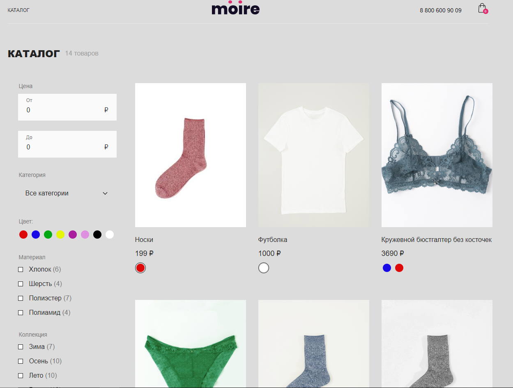

Добрый день, я начинающий веб разработчик и я написал интернет магазин, стилизация тут не очень, но это была не главная цель, основная цель это взаимодейсвтие с фреймворком vue.

Тут используется Pinia, axios, vue-router, написано все с использованием ts, ESLint и многое другое

Далее будет описано что реализовано в магазине:

Разработка интернет-магазина
Moire (премиальное бельё) на Vue.js
с использованием REST API.

Пользователь может выполнить на сайте
следующие действия:
\*Посмотреть список товаров по страницам.

\*Отфильтровать список товаров по параметрам.

\*Посмотреть информацию о товаре на его детальной странице.

\*Добавить товар с выбранным цветом и размером в корзину.

\*Изменить количество товаров в корзине.

\*Удалить товары из корзины.

\*Внести данные на странице оформления заказа.

\*Выбрать способ доставки и оплаты.

\*Оформить заказ и посмотреть информацию о нём на странице успешного
оформления заказа.

Состав продукта:

\*Список товаров.

\*Страница товара.

\*Корзина.

\*Оформление заказа.

\*Успешное оформление заказа.

Фильтр

Цена: Поля для ввода.

Категория: Выпадающий список с перечнем категорий, к которым
принадлежат товары. Единственный выбор. При выборе в выпадающем
списке параметра «Все категории» на странице выводятся товары всех
категорий.

Свойства для фильтрации:

Кнопка «Применить».

Кнопка «Сбросить». Выводится при условии, что пользователем задан хотя бы
один из параметров.

Цвет: Чекбокс, множественный выбор.

Материал: Чекбокс, множественный выбор.

Коллекция: Чекбокс, множественный выбор.

По клику на кнопку «Применить» производится проверка товаров на
соответствие выбранных пользователем параметров. В списке товаров
выводятся товары, соответствующие запросу пользователя. Фильтр между
параметрами работает по принципу логического «и».

Чтобы запустить его скачайте репозиторий, установите зависимости npm i и запустите проект npm run dev
