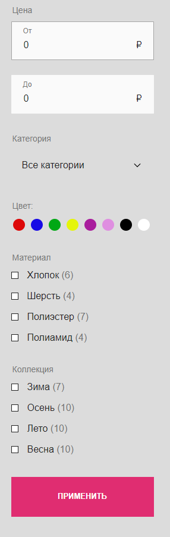
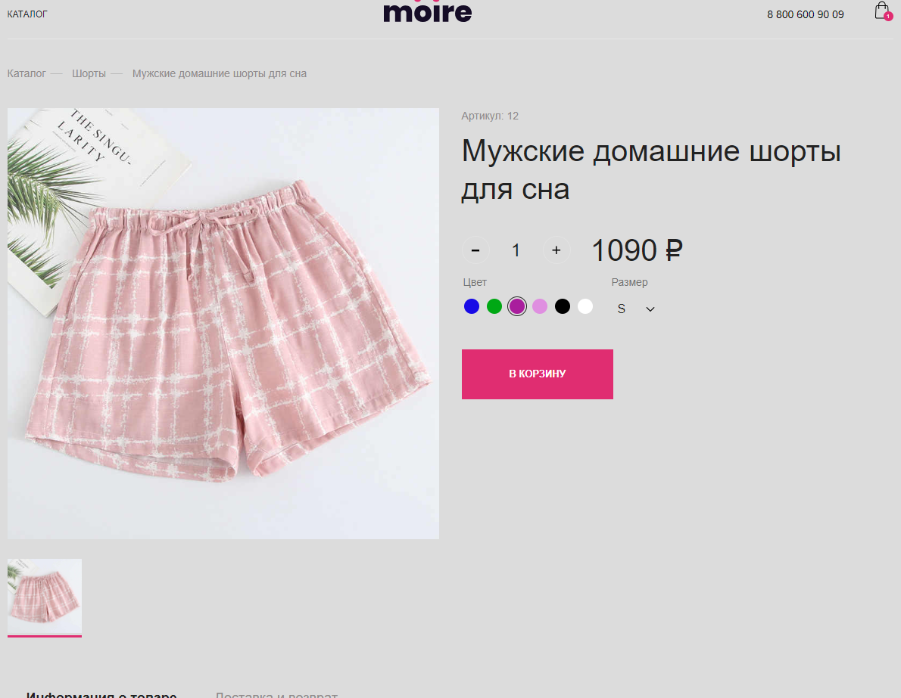
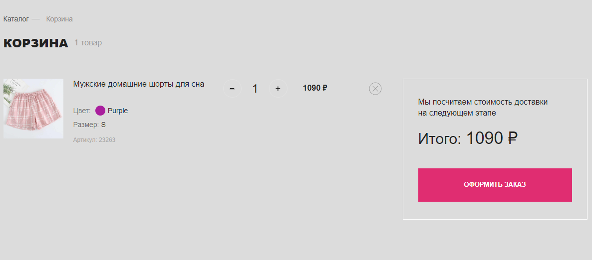
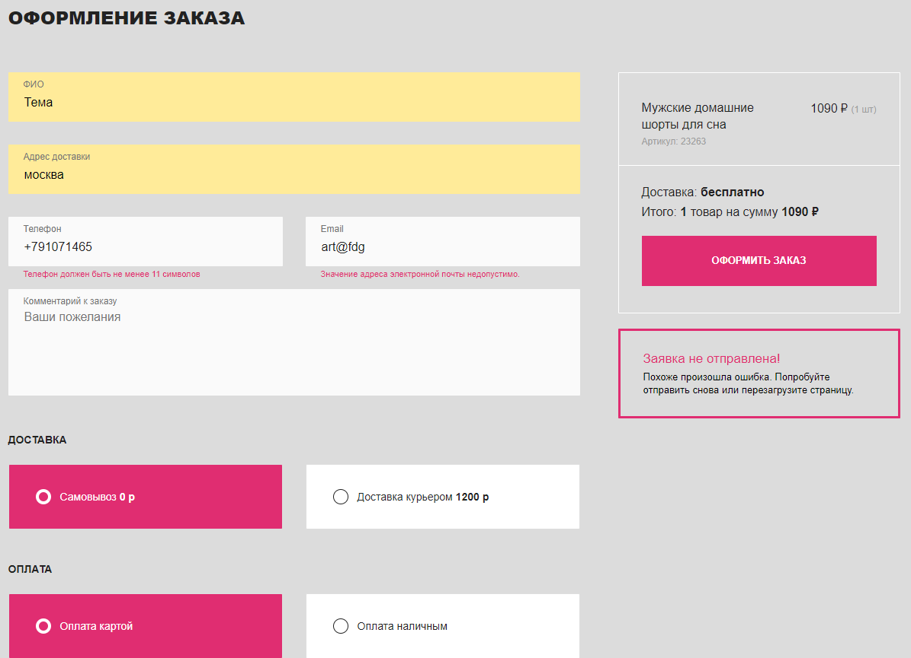
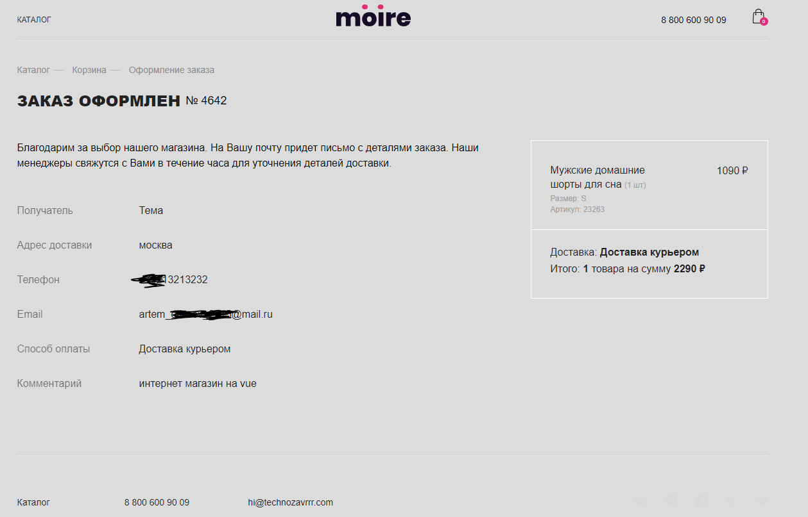

Добрый день, стилизация может показаться невзрачной, но она выдержана в рамках тз, основная цель это взаимодейсвтие с фреймворком vue.

Чтобы запустить его скачайте репозиторий, установите зависимости "npm i" и запустите проект "npm run dev"

Тут используется Pinia, axios, vue-router, написано все с использованием ts, ESLint и многое другое

Далее будет описано что реализовано в магазине:

Разработка интернет-магазина
Moire (премиальное бельё) на Vue.js
с использованием REST API.

Пользователь может выполнить на сайте
следующие действия:

\*Посмотреть список товаров по страницам.

\*Отфильтровать список товаров по параметрам.

\*Посмотреть информацию о товаре на его детальной странице.

\*Добавить товар с выбранным цветом и размером в корзину.

\*Изменить количество товаров в корзине.

\*Удалить товары из корзины.

\*Внести данные на странице оформления заказа.

\*Выбрать способ доставки и оплаты.

\*Оформить заказ и посмотреть информацию о нём на странице успешного
оформления заказа.

Состав продукта:

\*Список товаров.

\*Страница товара.

\*Корзина.

\*Оформление заказа.

\*Успешное оформление заказа.

Фильтр

Цена: Поля для ввода.

Категория: Выпадающий список с перечнем категорий, к которым
принадлежат товары. Единственный выбор. При выборе в выпадающем
списке параметра «Все категории» на странице выводятся товары всех
категорий.

Свойства для фильтрации:

Кнопка «Применить».

Кнопка «Сбросить». Выводится при условии, что пользователем задан хотя бы
один из параметров.

Цвет: Чекбокс, множественный выбор.

Материал: Чекбокс, множественный выбор.

Коллекция: Чекбокс, множественный выбор.

По клику на кнопку «Применить» производится проверка товаров на
соответствие выбранных пользователем параметров. В списке товаров
выводятся товары, соответствующие запросу пользователя. Фильтр между
параметрами работает по принципу логического «и».

Страница продукта.

*Выводится фотография в зависмости от выбранного цвета
*Можно выбрать цвет и размер товара
*Можно изменить кол-во товара
*Присутсвуют табы с информацией

Корзина.

*Выводятся товары с информацией
*Можно изменить кол-во товара
*Можно удалить товар
*Отображается итоговая цена

Оформление заказа.

*Присутствует валидация полей
*При успшном отправлении отображается информация о заказе
\*Отображаются товары учтенной ценой за доставку

Информация о заказе.

\*Отображается вся информация о заказе
